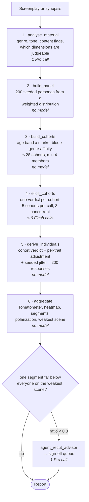

# The audience simulator

How Lumen turns a screenplay into 200 viewer reactions, and why each part is
built the way it is. This is the design record for
[`core/audience/personas.py`](backend/core/audience/personas.py),
[`domains/launch/agents/audience_sim.py`](backend/domains/launch/agents/audience_sim.py)
and [`domains/launch/agents/phase5_audience.py`](backend/domains/launch/agents/phase5_audience.py).

Every section states the decision, the alternative it beat, and what it costs.
The costs are the point: a design record that only lists strengths is a brochure.
What the simulator is actually worth against real films is measured separately,
in [`backend/eval/`](backend/eval/README.md).

---

## 1. The problem

A test screening tells a producer something no script note can: *which* viewers
lose interest, and *where*. Real ones cost tens of thousands of dollars and need
a finished cut, so they happen far too late to change much.

The simulator answers a narrower question, early: given this material, roughly
how will different kinds of viewer react, and which scene loses which group? It
is a directional instrument. Its job is to point at the act-two slowdown before
the shoot, not to predict an opening weekend.

**Output.** A Tomatometer (share of viewers scoring ≥ 6/10), an audience score
(mean × 10), a per-scene heatmap, the weakest scene, segment breakdowns, and — if
one group craters on the weakest scene — a recut request in the sign-off queue.

---

## 2. The central decision: a hybrid, not 200 prompts

**200 viewers, but the model is asked ≤ 28 questions.** Personas are grouped into
cohorts; the model returns one verdict per cohort; each individual response is
then derived from its cohort's verdict plus a deterministic adjustment computed
from the traits that vary *inside* that cohort.

The three options, and why this one:

| | Model calls per screening | Problem |
|---|---|---|
| One call per persona | 200 | 200 calls on a free tier is not a product. It is also the slowest possible way to get a number that is then averaged away. |
| One call for the whole panel | 1 | The model invents the distribution. Ask for "200 viewers' reactions" and you get a plausible-sounding spread with no mechanism behind it — nothing connects any number to any stated trait. |
| **Cohorts + derivation** | **≤ 6 batched** | The spread is computed from stated rules, not narrated by the model. Cheap, reproducible, and every individual score is traceable to a trait. |

**Why cohorts are the right seam.** The cohort key is age band × market bloc ×
genre affinity — the three traits that most change a reaction and that a model
can reason about honestly. Everything else (pacing tolerance, story preference,
openness, taste, prior familiarity, content sensitivity) varies *within* a cohort
and is applied afterwards as arithmetic. So the model does the part it is good at
(reading material, judging how a kind of viewer responds) and code does the part
it is bad at (producing a calibrated, reproducible distribution).

**What it costs.** The derivation layer is a hand-built model of taste. Its
coefficients — `pacing_tolerance: low → −1.6` on the pacing dimension, and the
rest — are reasoned guesses, not fitted parameters. Nothing in the repo yet
demonstrates that −1.6 is better than −1.0. That is the single largest soft spot
in the design, and the honest answer to "how do you know those numbers are
right" is: *I do not, and the eval harness is how I would find out — fit them on
a held-out film sample instead of choosing them.*

**Why it is labelled everywhere.** Every surface that shows these numbers says
they are a hybrid, because a producer who thinks 200 independent viewers were
consulted would over-trust the spread. `screening_source` (`live` / `mixed` /
`offline`) rides along with the report for the same reason.

### The mechanism, end to end

Four of the six stages use no model at all. That is deliberate: the model is
confined to the two judgements that need reading comprehension, and everything
downstream is arithmetic that reruns identically.

---

## 3. Who the personas are — and who they are not

**No sensitive attributes.** There is deliberately no gender, ethnicity,
religion, caste or income field. Personas vary on *taste and viewing behaviour*
plus the market they watch in.

This is the decision I would defend hardest. It is not squeamishness:

- It would not work. Inferring a reaction from a demographic label is exactly the
  stereotyping that makes synthetic audiences worthless — you get the model's
  prior about a group, dressed up as data.
- The system is aimed at casting and marketing decisions about real people. A
  tool that outputs "viewers of group X will dislike this" produces
  discriminatory decisions with a number attached to launder them.
- It is not needed. Taste, pacing tolerance and genre familiarity carry the
  signal that actually moves a reaction to a film.

The cohort prompt reinforces it: *"Avoid stereotypes. Reason about viewing habits
and genre expectations, not about identity"* and *"Do not describe a market or
age group as monolithic."*

**What it costs.** Real distribution decisions do get made on demographics, and
Lumen cannot inform those. A studio asking "how does this play with women over
40" gets no answer. I think that is the right trade, and it is a trade, not a
free win.

**Why age and market stay.** Age band and market are viewing-context facts, not
identity claims: certification regimes, dubbing and subtitle norms, and local
genre traditions genuinely differ, and they change what a viewer sees. Markets
are grouped into eight blocs for exactly the traits that change a reaction, and
never described as monolithic.

**The seeded, uneven distribution.** 200 personas are drawn from a weighted
distribution (24% US, 18% India, and so on) that a production can override per
simulation. It is deliberately uneven — a plausible international release mix,
not an even split, because an even split models no real release.

**Light conditioning, so the panel reads as people.** A market implies a language
mix; heavy viewers skew genre-familiar; niche tastes correlate with tolerance for
slower and stranger films. Without this the panel is random attribute soup:
"a 65-year-old rural horror superfan with low pacing tolerance who watches
everything" is a person the sampler can produce but the world rarely does.

**Genre affinity is capped, not forced.** Viewers matching the film's genre are
over-represented but capped, so roughly a third to a half of the panel is
genre-adjacent. A panel of only enthusiasts would return a flattering number
about nothing.

---

## 4. Reproducibility

`build_panel(size, seed, distribution)` is pure: the same inputs always yield
byte-identical personas. The seed is derived from the production id and the
script fingerprint, so **the same screenplay on the same production always gets
the same panel** — and a changed script gets a new one.

This matters more than it sounds. A producer who reruns a screening and sees the
Tomatometer move by four points learns nothing about their film; they learn the
tool is noisy. Every stochastic element is seeded: the panel, and the per-persona
jitter (a SHA-256 of `seed:persona_id:key` mapped to ±spread, rather than an RNG
whose draw order would depend on iteration order).

`distribution_fingerprint` is stored with each simulation, so a stored result
records exactly which configuration produced it.

**What it costs.** Genuinely identical reruns mean no free confidence interval
from repeated sampling. To get one you would vary the seed deliberately — which
is the right way to do it, but it is not built.

---

## 5. Making 200 people out of 28 verdicts

`derive_individuals` is where the panel stops being cohorts. Each adjustment is
keyed to a trait the cohort did **not** encode, so two members of one cohort
diverge for a reason you can point at:

| Trait | Effect | Reasoning |
|---|---|---|
| `pacing_tolerance` | pacing −1.6 / 0 / +1.0 | The largest single adjustment, because patience for slow film is the trait that most splits an audience on the same cut. |
| `story_preference` | characters +0.7 / −0.4; story +0.5 (plot-driven) | A character-driven viewer rates the same characters higher than a plot-driven one. |
| `experimental_openness` | originality −0.7 / 0 / +0.9 | Novelty reads as fresh or as self-indulgent depending on the viewer. |
| `prior_familiarity_with_similar` | originality +0.4 / 0 / −0.6 | Someone who has seen twenty of these finds it less original. Not a quality judgement — a fact about the viewer. |
| `taste_profile` | entertainment +0.4 / 0 / −0.3 | Mainstream taste is more entertained by mainstream entertainment. |
| `viewing_frequency` | overall −0.25 / 0 / +0.2 | Frequent filmgoers grade harder. |
| content aversion | overall −0.55 per strong flag | Only fires when the material carries a `moderate`/`strong` flag on an axis this viewer is averse to. |
| `genre_familiarity` | genre satisfaction −0.3 / 0 / +0.5 | Someone fluent in the genre's conventions judges whether this one delivers them; someone outside it barely registers the question. |
| seeded jitter | ±0.55 per dimension | Two otherwise identical viewers are still different people. |

Then a weighted overall (story 0.20, characters 0.18, pacing 0.14, emotional
impact 0.12, entertainment 0.12, originality 0.10, dialogue 0.06, ending 0.04,
genre satisfaction 0.04), clamped to 1–10.

**Cohort rates become individual decisions.** The model returns
`would_watch_rate: 0.72` for a cohort. Turning that into per-person answers uses
the person's own score: `draw < clamp(rate + (overall − 6)/8)`. A viewer who
scored the film 8.5 is likelier to recommend it than a cohort-mate who scored
5.0, which is both obvious and absent if you just sample the rate 200 times.

**Two honest weaknesses.**

1. **The adjustments are additive and independent.** Real taste interacts — low
   pacing tolerance probably matters *more* on a deliberately paced film than the
   flat −1.6 allows. There is one interaction term (`pacing_read` starting
   "deliberate" adds a further −0.5 for low-tolerance viewers) and it is a token
   gesture at a real effect.
2. **Only `evaluable_dimensions` are scored, but the weights are fixed.** On a
   synopsis, dialogue and ending are withheld — correctly, since a synopsis
   cannot speak to them — and the remaining weights are renormalised. So the same
   film scored from a synopsis and from a full script is scored on different
   dimension sets. Comparable within an input type, not across.

---

## 6. Failure handling: never lose a persona

The rule: **a failed model call costs resolution, never a viewer.** If a batch
raises, every cohort in it takes its offline verdict and is marked `_degraded`.
If a reply omits a cohort, that cohort is filled the same way. If a live verdict
skips a scene or scores it with something that is not a number, that one scene
takes the offline score and the verdict is flagged.

Without this, a partial reply silently drops personas and the denominator moves —
so the Tomatometer would shift because of an API hiccup, and nothing on screen
would say so. That is the worst class of bug in this system: a wrong number that
looks right.

The counterpart rule is that degradation is always *visible*. `screening_source`
reports `live`, `mixed` or `offline`; `model_use` counts live and sample calls
per phase; the Overview and Audience pages say when a plan is sample output.

**Where this bites.** `elicit_cohorts` returns exceptions as values rather than
raising, so one bad batch cannot abort a screening — but it also means a
systematically failing key produces a complete, plausible, entirely offline
report. Hence the `mixed`/`offline` labelling, and hence the eval harness
refusing to grade any film whose cohorts all fell back.

---

## 7. Anomaly detection and the recut request

Aggregation finds the weakest scene, then asks whether any *group* is far below
everyone else on it. Five segmentations are compared (age band, market region,
genre affinity, pacing tolerance, viewing frequency). A group scoring below 80%
of the whole panel's score on that scene, with at least `max(8, 5% of panel)`
members, gets a diagnosis from `agent_recut_advisor` and an item in the sign-off
queue.

Three choices in that sentence:

- **A ratio, not a fixed gap.** A 1.5-point gap means something different at 7.5
  than at 4.0.
- **A minimum group size.** Without it, the smallest slice always looks like the
  most extreme, and a 3-person group would generate a recut request off noise.
- **Segments are read off computed numbers, never invented.** `strongest_segments`
  and `weakest_segments` are sorted from the aggregate, so the model cannot
  narrate a segment the arithmetic does not support.

Only the *weakest* scene is examined. A group might drift somewhere else too;
that is not looked for. Bounded, on purpose, because the sign-off queue competes
for a person's attention and a queue of twelve maybes is a queue nobody reads.

---

## 8. The cost model

Free-tier Gemini, so calls are the binding constraint:

| Stage | Calls |
|---|---|
| `analyse_material` | 1 (Pro) |
| `elicit_cohorts` | ≤ 6 (Flash), 5 cohorts per call, 3 concurrent |
| recut diagnosis | 0 or 1 (Pro) |
| **Per screening** | **≈ 5–8** |

`MAX_COHORTS = 28` is a hard ceiling on fan-out *independent of panel size*, so a
production configuring a 2,000-persona panel does not multiply the bill. Small
cohorts (< 4 members) and any beyond the cap fold into their most similar
surviving cohort, so every persona is represented exactly once.

The free tier allows ~20 requests per model per day. That is roughly three
screenings, and it is why the evaluation harness is built to resume.

---

## 9. Interview questions I should expect

**"Is this just 200 copies of one LLM answer?"** No — and the honest version of
the answer is that it is not 200 independent answers either. It is 28 model
verdicts expanded by a stated, auditable per-trait model. The spread within a
cohort comes from arithmetic on traits, not from the model. That is a real
limitation and it is labelled in the product.

**"Why should I believe the coefficients?"** You should not, yet. They are
reasoned, not fitted. The eval harness is the path to fitting them.

**"What does the eval actually show?"** See [`backend/eval/`](backend/eval/README.md)
for the design: 31 post-cutoff films, TMDb audience ratings as ground truth, MAE
and Spearman ρ, against a one-prompt baseline and a constant-predictor floor. The
harness is committed and tested; the live numbers are pending a free-tier quota
reset, and until they exist I should claim nothing about accuracy.

**"Why no demographics?"** Section 3. Short version: it would not work, it would
produce discriminatory outputs, and taste carries the signal anyway.

**"What would you change first?"** Fit the derivation coefficients on held-out
films instead of choosing them. Second: interaction terms between pacing
tolerance and the material's pacing. Third: vary the seed deliberately to
produce a confidence interval instead of a single point.

**"What is the weakest part?"** The derivation layer's coefficients, closely
followed by the fact that a systematically failing key yields a complete,
plausible, entirely offline report — mitigated by labelling, not prevented.

---

## 10. Where the code lives

| File | What it holds |
|---|---|
| [`core/audience/personas.py`](backend/core/audience/personas.py) | the distribution, `build_panel`, `build_cohorts`, genre normalisation |
| [`domains/launch/agents/audience_sim.py`](backend/domains/launch/agents/audience_sim.py) | the seven stages, `elicit_cohorts`, `derive_individuals`, `aggregate` |
| [`domains/launch/agents/phase5_audience.py`](backend/domains/launch/agents/phase5_audience.py) | Phase V: scene screening, Tomatometer, anomaly detection, reviews |
| [`domains/launch/audience_prompts.py`](backend/domains/launch/audience_prompts.py) | prompt contracts and the deterministic offline verdicts |
| [`backend/eval/`](backend/eval/README.md) | the accuracy evaluation against real films |

Tests: `tests/test_personas.py`, `tests/test_phase5_screening.py`,
`tests/test_audience_runs.py`, `tests/test_distribution.py`,
`tests/test_live_output_guards.py`, `tests/test_eval.py`.
