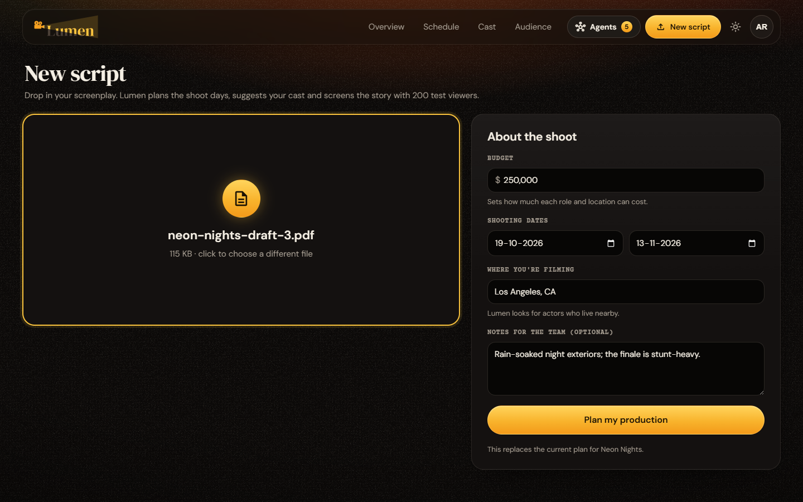
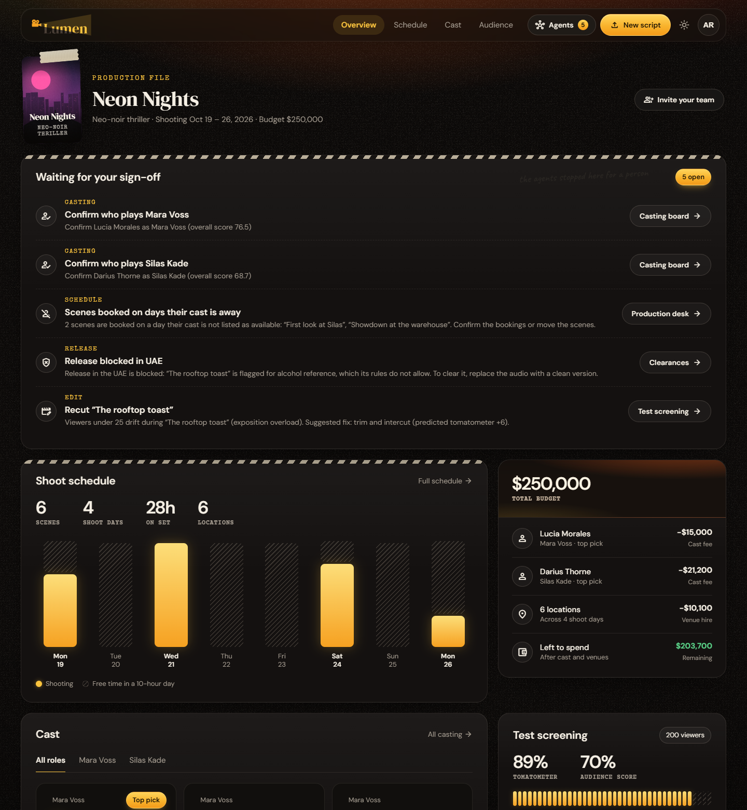
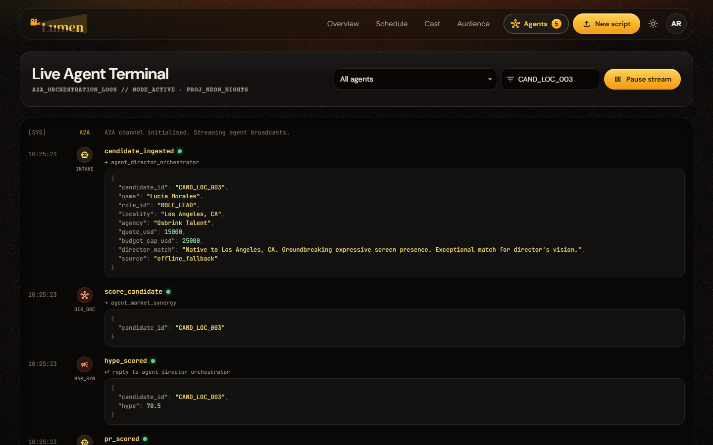
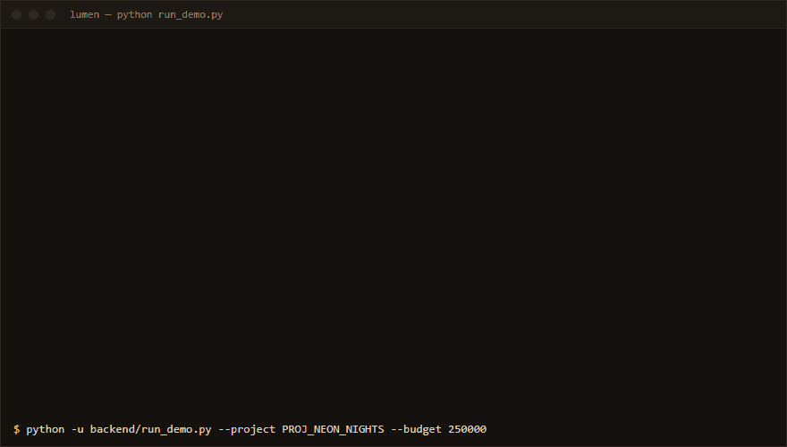

<p align="center">
  
</p>

# 🎬 CineNode

> One multi-agent system that takes a film from **script → screen → social launch**.
> Built for **Agentic Cinema: The Blockbuster Hackathon** (Google Cloud · Replit Track).

CineNode is a network of specialized AI agents that run the entire film lifecycle as **six connected phases** — casting, scheduling, compliance, audience testing, and marketing — sharing **one orchestrator, one state object, and one agent-to-agent (A2A) messaging standard**. Scale follows the budget you enter at intake: casting caps, venue choices and territory reach all derive from it.

It is a true **Multi-Agent System (MAS)**: agents ask each other questions, get answers, and change their own behavior — humans only sign off at the top.

---

## See it

> **Captures pending.** Save the files at the paths below and uncomment the
> embeds — no other edit needed. Delete this note once they're in.
> Not yet deployed, so there is no hosted demo link; run it locally with the
> [Getting Started](#getting-started) steps (works with an empty `.env`).

| Slot | Save as | Should show |
|---|---|---|
| Screenshot 1 | `assets/screenshots/01-intake.png` | Cover page / intake — script dropped, budget + shooting window entered |
| Screenshot 2 | `assets/screenshots/02-pipeline.png` | A phase dashboard mid-run — leaderboard, stripboard or the Tomatometer |
| Screenshot 3 | `assets/screenshots/03-terminal.png` | Live Agent Terminal scrolling the A2A envelopes |
| GIF | `assets/screenshots/pipeline.gif` | ~10s of `run_demo.py` streaming all six phases (see recipe below) |

<!-- Uncomment once the files above exist:




-->

<details>
<summary>Recording the pipeline GIF</summary>

The terminal run is the clearest proof it's a real MAS — 150 A2A messages
across six phases, no keys required:

```bash
cd backend
python -u run_demo.py --project PROJ_NEON_NIGHTS --budget 250000 --verbose
```

Record that with any terminal recorder (`asciinema rec` + `agg`, `vhs`, or a
screen capture) and save the result as `assets/screenshots/pipeline.gif`.
Keep it under ~10s and start at `[PHASE1]` so the phase banners are the first
thing on screen.
</details>

---

## The Problem

Turning a screenplay into a finished, marketed film is a two-week-per-step manual grind: breaking down scenes, vetting cast, solving the scheduling constraint puzzle, clearing rights for every territory, guessing at audience reaction, and building a campaign. Every step is a bottleneck, and they don't talk to each other.

## The Solution — Six Phases, One Brain

| Phase | Name | What it does |
|---|---|---|
| **I** | Pre-Casting Intelligence & Compliance | Turns script + brief into casting mandates; fail-fast filters applicants on PR/budget risk |
| **II** | Audition Analysis & Scorecard | Grades performances into a composite leaderboard (tape decode/transcribe is stubbed) |
| **III** | Script → Schedule | Breaks down scenes, matches venues, builds the stripboard + burn-rate budget |
| **IV** | Compliance, Localization & Launch Prep | Clears rights, localizes/censors per territory, runs QC |
| **V** | Audience Simulation & Predictive Reviews | 200 synthetic viewers screen the cut → Tomatometer + fix suggestions |
| **VI** | Marketing, PR & Autonomous Social Launch | Plans reels/memes/posters + copy, PR-gates each one, schedules the rollout (assets are specs, not rendered pixels) |

Full spec and agent contracts: see [`AGENT.md`](./AGENT.md). Shared schemas live in [`contracts/`](./contracts); advisor procedures in [`skills.md`](./skills.md).

---

## Architecture

```
                        ┌─────────────────────────────┐
                        │  agent_director_orchestrator │   phase DAG runner
                        │  (owns GlobalState, routing) │   + fail-fast edges
                        └──────────────┬──────────────┘
                                       │  reads/writes
                        ┌──────────────▼──────────────┐
                        │        GlobalState (JSON)     │  local .state/ or Supabase
                        └──────────────┬──────────────┘
                                       │
   PHASE I → PHASE II → PHASE III → PHASE IV → PHASE V → PHASE VI
   (each phase = a subgraph of agents; all speak the same A2A envelope)
                                       │
                        VI → I  PR-risk + telemetry loop back
```

- **Orchestration:** a dependency-free state machine in `backend/core/orchestrator/graph.py` — every phase is a node with fail-fast edges. The node signature is deliberately LangGraph-shaped so the runner can be swapped for a real `StateGraph` later, but nothing today imports LangGraph.
- **Every agent** communicates via the standard A2A envelope (`sender`, `recipient`, `intent`, `payload`).
- **A "Live Agent Terminal"** in the UI streams these JSON messages in real time — the proof it's a real MAS.

---

## Tech Stack

Everything below is wired into code today. Where a key is absent the pipeline
falls back to a deterministic mock, so the whole thing runs with an empty `.env`.

| Layer | Choice | Where it lives |
|---|---|---|
| Orchestration | Plain-Python phase DAG with fail-fast edges | `backend/core/orchestrator/graph.py` |
| Reasoning LLM | **Gemini** via `google-genai` — `gemini-3.6-flash`, with a fallback model chain | `backend/services/gemini_client.py` |
| Web search | **Tavily** REST (no SDK — `urllib`); optional, skipped when unset | `backend/services/tavily_client.py` |
| Actor knowledge base | **TMDb** ingest → **PostgreSQL + pgvector**, `sentence-transformers` embeddings (optional extra) | `backend/services/casting_kb/` |
| Script intake | **pypdf** for the PDF branch (`.txt`/`.fountain`/`.fdx` need no package) | `backend/services/script_intake.py` |
| Persistence + Auth | **Supabase** (Postgres) when `SUPABASE_URL`/`KEY` are set, else local JSON under `backend/.state/` | `backend/services/{supabase_client,auth_store,simulation_store}.py` |
| Backend | **Python 3.10+ · FastAPI · Pydantic v2 · Uvicorn** | `backend/main.py` |
| Frontend | **React 18 · React Router · Vite**, hand-rolled CSS design system (custom properties, `data-theme` light/dark) | `frontend/src/` |
| Packaging | **Docker**, **Google Cloud Run** (`cloudbuild.yaml`, `deploy-cloudrun.sh`) | repo root |
| Secrets | `.env` locally · Google Secret Manager on Cloud Run | `.env.example` |

**Not in the build yet.** These appear in the agent spec and are stubbed or
config-only — no code path calls them, so don't count them as integrations:
LangGraph (commented out in `requirements.txt`), Google Cloud Agent Builder,
Imagen 3 (`agent_visual` returns mock assets), FFmpeg + Whisper
(`agent_media_proc` is a stub), and Lyria.

---

## Repository Structure

```
cinenode/
├── README.md
├── AGENT.md                     # agent registry, A2A + GlobalState contracts
├── assets/                      # logo + brand (the o of Node is the camera)
│   └── screenshots/             # README captures + pipeline GIF
├── skills/                      # SKILL.md procedures the advisor agents follow (skills/README.md)
├── contracts/                   # SACRED: shared JSON schemas — change only with team agreement
│   ├── a2a_envelope.json
│   └── global_state.json
├── backend/
│   ├── main.py                  # FastAPI entrypoint (mounts one router per domain)
│   ├── run_demo.py              # CLI: full pipeline on mock data
│   ├── migrations/              # PostgreSQL/pgvector schema (actor KB)
│   ├── scripts/                 # one-off maintenance scripts
│   ├── core/                    # THE BRAIN — shared by everyone
│   │   ├── config.py            # env vars, model tiers, guardrail constants
│   │   ├── orchestrator/
│   │   │   ├── graph.py         # phase DAG + fail-fast edges
│   │   │   └── state.py         # GlobalState Pydantic models
│   │   ├── messaging/envelope.py  # A2A envelope helper (shared by ALL agents)
│   │   ├── audience/            # synthetic-viewer simulation engine
│   │   ├── auth/                # sessions, invites, memberships
│   │   └── skills/              # SKILL.md loader + runner
│   ├── services/                # gemini_client, tavily_client, supabase_client,
│   │                            #   auth_store, simulation_store, skill_store,
│   │                            #   script_intake, mock_db, casting_kb/
│   ├── mock_data/               # script, candidates, venues, censorship rules, personas
│   └── domains/                 # THE SANDBOXES — one per team member
│       ├── casting/             # ➔ Raymond (Phases I & II): router, agents/, prompts
│       ├── production/          # ➔ Shriya (Phases III & IV)
│       ├── launch/              # ➔ Swati (Phases V & VI)
│       └── audience/ auth/ skills/   # cross-cutting routers
├── frontend/
│   └── src/
│       ├── shared/LiveAgentTerminal.jsx   # real-time A2A message scroller
│       ├── features/            # intake, casting, production, launch, advisors,
│       │                        #   audience, auth, logs, team, settings
│       ├── theme/               # light/dark token provider
│       └── lib/                 # api.js, utils.js
├── docker-compose.yml
└── .env.example
```

**Zero-key dev loop:** every agent has a mock fallback, so the entire six-phase
pipeline runs before any API key exists — `python backend/run_demo.py` just works.

---

## Getting Started

### Prerequisites
- Python 3.10+, Node 18+
- Nothing else. Every key below is optional — with an empty `.env` the full
  six-phase pipeline still runs on mock fallbacks.

### 1. Configure environment
Copy `.env.example` to `.env`. All of these are optional:

```bash
GEMINI_API_KEY=...         # live agent reasoning; mock fallbacks work without it
TAVILY_API_KEY=...         # web-grounded cultural/censorship research; skipped when unset
SUPABASE_URL=...           # shared persistence; without it state goes to backend/.state/
SUPABASE_KEY=...           #   set this for any deploy with an ephemeral filesystem
DATABASE_URL=...           # Phase I actor KB only (PostgreSQL + pgvector)
TMDB_API_KEY=...           # Phase I actor KB only
```

> Never commit `.env`. On Cloud Run these come from Google Secret Manager.

### 2. Backend
```bash
cd backend
pip install -r requirements.txt
uvicorn main:app --reload --port 8000
```

### 3. Frontend
```bash
cd frontend
npm install
npm run dev
```

### 4. Run a full pipeline (demo)
```bash
# kicks off PROJ_NEON_NIGHTS through all six phases with mock data
python backend/run_demo.py --project PROJ_NEON_NIGHTS --budget 250000
```

### Actor knowledge base (Phase I)

The actor KB connection code is in `backend/services/casting_kb/` and its
schema is `backend/migrations/001_actor_knowledge_base.sql`. Run the migration
against a PostgreSQL database with pgvector enabled, then install the backend
requirements and set `DATABASE_URL`, `TMDB_API_KEY`, and optionally
`EMBEDDING_MODEL`/`EMBEDDING_DIMENSIONS`.

Populate and search it through the casting API:

```bash
curl -X POST http://localhost:8000/api/casting/actors/ingest \
  -H 'Content-Type: application/json' \
  -d '{"actor_ids":[6193,500]}'
curl -X POST http://localhost:8000/api/casting/actors/embeddings
curl 'http://localhost:8000/api/casting/actors/search?character_description= cunning detective in her forties&gender=1&min_age=35&max_age=49'
```

TMDb does not normally provide physical measurements or appearance traits, so
the ingestion code stores only explicitly supplied trait fields and does not
infer sensitive attributes from photos or names.

### Agent skills

`skills/<name>/SKILL.md` files (casting, scheduling, audience-simulation,
cultural-research) are procedures the advisor agents follow: the Markdown body
is the agent's system instruction. Open **Agent Skills** in the dashboard and
press **Run** on a card, or call `POST /api/skills/<name>/run/<project_id>`.
Runs work offline on a deterministic fallback and go live once `GEMINI_API_KEY`
is set. The dashboard calls them **AI Advisors**. See `skills.md` for the full
catalogue, `skills/README.md` for the file format, and `AGENT.md` Section 8.

---

## Budget-driven scale

There are no tiers or modes. The total budget from the intake cover page lands in `GlobalState.budget_state.cap` and every downstream limit is derived from it (shares live in `backend/core/config.py`):

- **Casting** — a single role may cost at most 10% of the budget; pricier quotes are purged by the fail-fast wallet check.
- **Locations** — venues are picked cheapest-first, and 15% of the budget spread over the shoot days is the daily burn allowance.
- **Reach** — every territory with a rule set is cleared; the same code scales from a bootstrapped short to a studio slate.

---

## 3-Minute Trailer Script (demo beats)

1. **Drop the script** for `PROJ_NEON_NIGHTS` on the cover page with a $250k budget and a shooting window.
2. **Phase I/II:** watch an over-budget applicant auto-rejected; a leaderboard builds itself.
3. **Phase III:** Scheduler ↔ Location Agent negotiate a venue conflict live in the terminal; the Gantt reflows.
4. **Phase IV:** the UAE cut hits a compliance block; the world map turns that territory red.
5. **Phase V:** 200 synthetic viewers stream verdicts; the Tomatometer ticks up; Aggregation flags Act 2 and the Recut Advisor predicts a +6 lift.
6. **Phase VI:** a meme is drafted, rejected by PR Risk for a spoiler, redrafted clean, and scheduled — cut from Phase V's top scene.
7. **Close:** the Live Agent Terminal scrolls the whole A2A conversation — *150 messages, no human in the loop until the sign-off queue.*

---

## How It Maps to Judging Criteria

- **Technological Implementation:** genuine A2A MAS with a shared protocol + fail-fast orchestration.
- **Design:** one coherent product across six phases, with live dashboards.
- **Potential Impact:** addresses the real, expensive bottlenecks of film production at any budget, from a bootstrapped short to a studio slate.
- **Quality of Idea:** agents that negotiate and self-correct, not a chatbot with buttons.

---

## Team & Phase Ownership

| Phases | Owner |
|---|---|
| Casting | **Raymond** |
| Schedule & Compliance | **Shriya** |
| Audience & Marketing | **Swati** |

---

## License

Open-source under the **MIT License** (see `LICENSE`). Required for hackathon submission.
