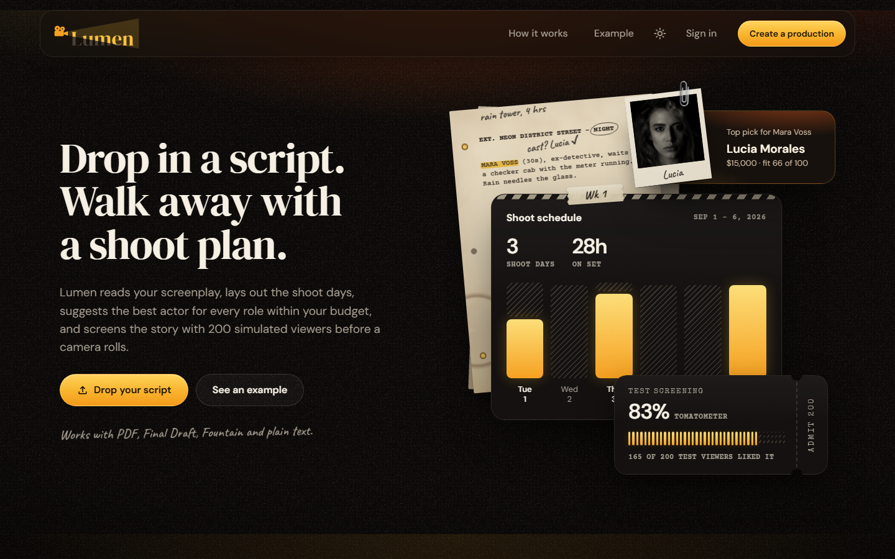
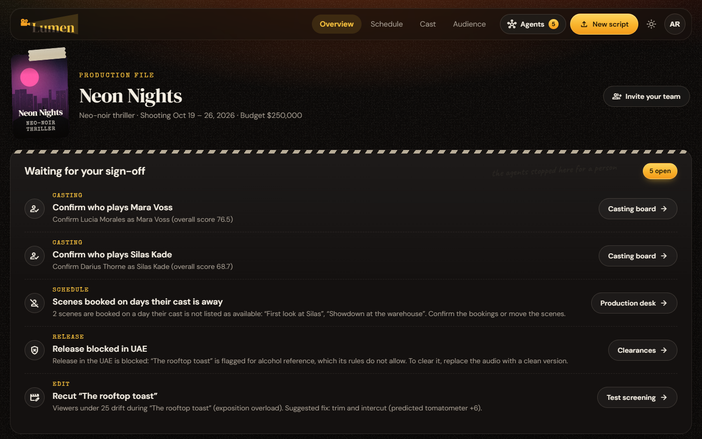
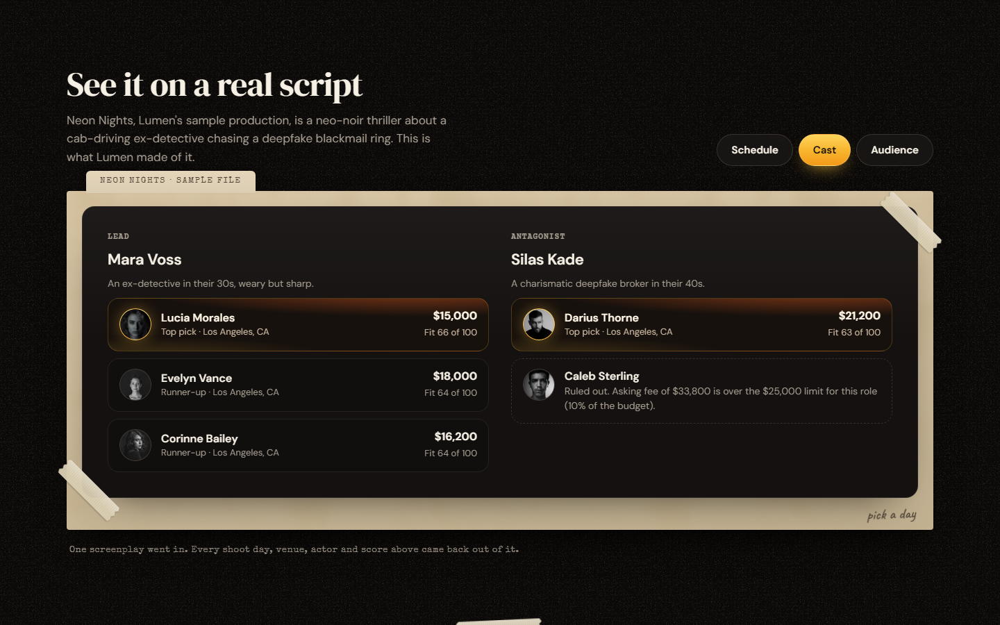
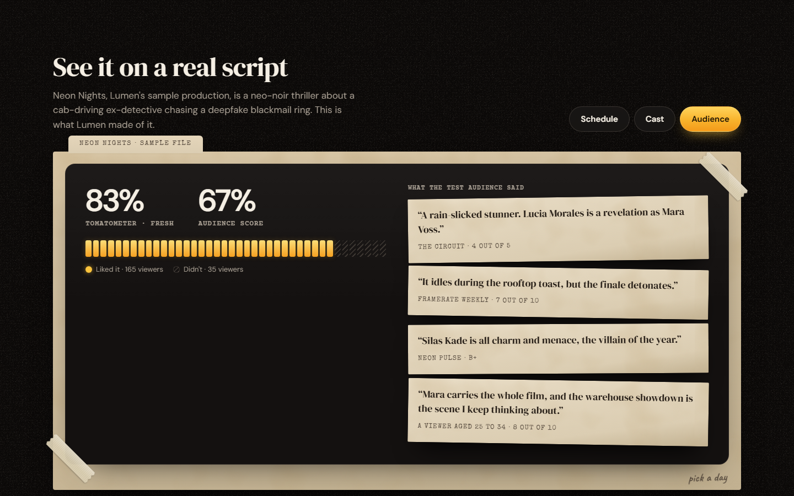
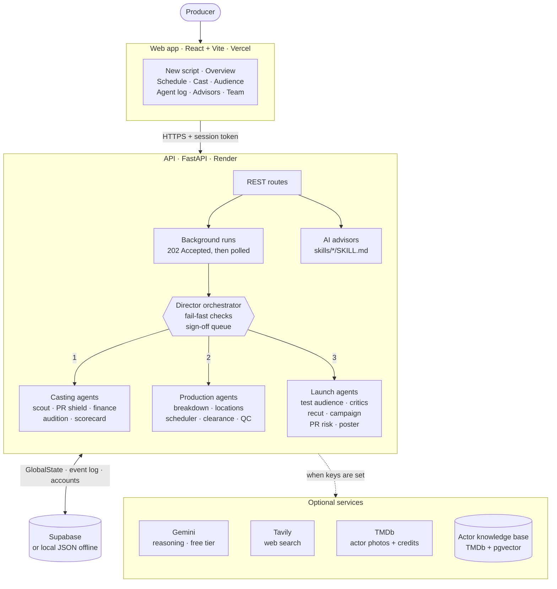
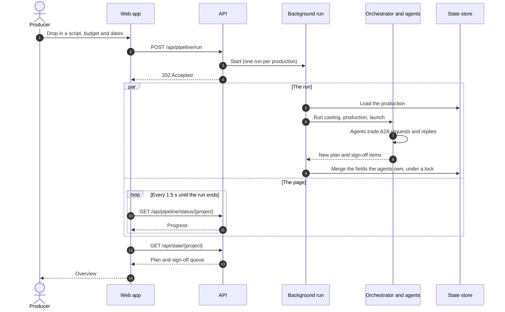

<p align="center">
  
</p>

<p align="center">
  <b>An autonomous film studio in software.</b><br />
  Drop in a screenplay and a budget. Lumen's AI agents cast it, schedule the shoot,
  clear it for release, test-screen it with 200 synthetic viewers and plan the launch,
  then hand you only the calls they can't make.
</p>

<p align="center">
  <a href="https://github.com/sizzywizzy/Lumen/actions/workflows/ci.yml"></a>
  
  
  
  
  <a href="LICENSE"></a>
</p>



## What it does

Turning a screenplay into a planned, tested and marketed film takes weeks of
separate jobs: breaking down scenes, vetting cast, solving the schedule,
clearing each territory, guessing how audiences will react, planning the
campaign. In Lumen, 30-plus specialist agents split that work between them and
trade requests and answers in one shared message format.

- **Casting.** Finds working actors near the shoot through web search, scores
  each on audition fit, buzz, PR risk and fee, and drops anyone too risky or
  over budget before the expensive checks.
- **Scheduling.** Breaks the script into scenes, books venues on days the whole
  cast is free, and lays out the shoot days and the daily spend.
- **Release clearance.** Checks every scene and music cue against each
  territory's rules, and says what blocks a release and how to fix it.
- **Test screening.** 200 synthetic viewers score the film scene by scene:
  Tomatometer, audience score, reviews, the scene where a group of viewers
  drifts, and a suggested recut.
- **Launch.** Plans the campaign's reels, memes and copy, sends each through a
  PR-risk check that bounces spoilers, schedules the rollout and designs the
  film's poster.
- **Sign-off queue.** Cast picks, schedule clashes, blocked territories and
  recuts wait on the Overview, each linked to the page where it is decided.
- **Live Agent Terminal.** Every message between agents, filterable by agent
  and content.
- **AI advisors and teams.** On-demand casting, scheduling, audience and
  cultural-research advisors, plus invite links with owner, producer and crew
  roles.

The budget sets the limits: one role may cost at most 10% of it, and 15% of
it, spread over the shoot days, is the daily venue allowance.

## Screenshots

<!-- 01, 02-pipeline and 03 come from the signed-in app. 00, 04 and 05 are the
     public homepage, captured in headless Chrome at 1440x900; 02-signoff is
     the top of 02-pipeline. To re-record pipeline.gif, run
     `cd backend && python -u run_demo.py --project PROJ_TERMINAL_DEMO --budget 250000`
     under a terminal recorder (asciinema + agg, or vhs) and keep about ten
     seconds from the prompt. -->

<table>
  <tr>
    <td width="50%" valign="top">
      <br />
      <b>New script.</b> The screenplay, budget, shoot dates and location.
    </td>
    <td width="50%" valign="top">
      <a href="assets/screenshots/02-pipeline.png"></a><br />
      <b>Overview.</b> What the agents left for a person. Click for the full page.
    </td>
  </tr>
  <tr>
    <td valign="top">
      <br />
      <b>Cast.</b> A top pick and runners-up per role; an over-budget actor is ruled out with the reason.
    </td>
    <td valign="top">
      <br />
      <b>Test screening.</b> Scores and reviews from 200 synthetic viewers.
    </td>
  </tr>
  <tr>
    <td valign="top">
      <br />
      <b>Live Agent Terminal.</b> A scoring request and the agents that answer it.
    </td>
    <td valign="top">
      <br />
      <b>Terminal demo.</b> A full run, about 110 agent messages, no API keys.
    </td>
  </tr>
</table>

## How it works



- **One orchestrator, one state.** [`graph.py`](backend/core/orchestrator/graph.py)
  is a plain-Python state machine, no agent framework. It runs the casting,
  production and launch agents in turn over a single `GlobalState`, and a
  fail-fast check can stop a run and hand it to a person.
- **One message format.** Every request, reply and broadcast between agents is
  an A2A envelope like the one below, and every envelope lands in the
  production's event log, which is what the Live Agent Terminal shows.
  A negotiation stops after two rounds.
- **Validated output.** Model replies are JSON, checked field by field.
  Anything malformed falls back to the agent's deterministic mock, which is
  also what runs when no key is set. A run counts both kinds, and the
  Overview and Audience pages say when a plan is sample output rather than
  a read of your screenplay.
- **Safe background runs.** A run answers `202` and the page polls it. When it
  finishes, only the fields its agents own are merged onto the stored state,
  so edits saved during the run are kept.

```json
{
  "message_id": "msg_loc_req_89234",
  "sender": "agent_localization",
  "recipient": "agent_rights_clearance",
  "timestamp": "2026-08-16T15:45:12Z",
  "intent": "verify_regional_compliance",
  "payload": { "scene_id": "SCN_004", "target_territory": "UAE",
               "elements_to_check": [{ "type": "dialogue", "tags": ["alcohol_reference"] }] }
}
```

A planning run, end to end:



The agent registry, intent vocabulary and `GlobalState` schema are in
[AGENT.md](AGENT.md), the JSON schemas in [`contracts/`](contracts), and the
advisors' procedures in [skills.md](skills.md).

## Tech stack

| Layer | Built with |
|---|---|
| Frontend | React 18, React Router 7, Vite; hand-rolled CSS with light and dark themes |
| Backend | Python, FastAPI, Pydantic v2, Uvicorn |
| AI | Gemini through `google-genai` (free tier only); Tavily web search; TMDb actor photos |
| Data | Supabase (Postgres), or local JSON with no setup; TMDb actor knowledge base on pgvector |
| Script formats | PDF, Final Draft, Fountain, plain text |
| Ops | GitHub Actions CI; Vercel, Render and Supabase for hosting |

Lumen plans media rather than rendering it: campaign assets are art-direction
specs, auditions are judged from the role brief and the tape link, and the
poster is the one image it makes: art Lumen draws itself, with a tagline and
colours Gemini picks from your script.

## Getting started

You need Python 3.10+ and Node 20+. API keys are optional: with an empty
`.env`, every agent runs on its offline fallback and the built-in
*Neon Nights* script stands in for yours.

```bash
cp .env.example .env

# Terminal 1: the API on http://localhost:8000
cd backend
pip install -r requirements.txt
uvicorn main:app --reload --port 8000

# Terminal 2: the web app on http://localhost:5173
cd frontend
npm install
npm run dev
```

Open http://localhost:5173, create a production, and press
**Plan my production** on the New script page. In the sample run, an
over-budget actor is ruled out, the scheduler and the location agent move a
scene, the UAE release is blocked over an alcohol reference, a spoiler meme is
rejected and redrafted, and the recut advisor predicts a +6 Tomatometer lift.
The whole conversation is under **Agents → Agent log**.

| Key in `.env` | Turns on | Cost |
|---|---|---|
| `GEMINI_API_KEY` | Live reasoning; Lumen reads your own script | Free tier |
| `TAVILY_API_KEY` | Web search for talent scouting and cultural research | Free plan: 1,000 searches a month |
| `TMDB_API_KEY` | Photos and credits for the actors the scout finds | Free for non-commercial use |
| `SUPABASE_URL`, `SUPABASE_KEY` | Shared storage instead of `backend/.state/` (required when deployed) | Free plan |
| `DATABASE_URL` | The [actor knowledge base](backend/services/casting_kb/README.md), with `TMDB_API_KEY` | Free plan |

Lumen uses only free plans, so running it costs nothing, and it has no code
for paid features: no Google Search grounding, image generation or Vertex AI.
On each run the scout makes two Tavily searches. Gemini suggests actors from
those pages only, and any name the pages don't mention is dropped. When
exactly one actor on TMDb has that name, TMDb adds a photo and credits,
labelled as a match by name. Fees and follower counts for these actors are
labelled as estimates. Free Gemini keys have per-minute and daily request
limits, so a run may slow down while Lumen waits them out. Google's terms let
it use free-tier prompts to improve its products, so don't upload a script
that must stay confidential. Keep billing off on the Google project behind
your key: a project without a billing account is never charged.

[`.env.example`](.env.example) lists the rest (model choices, CORS).
A few more commands; `make help` lists a shortcut for each:

```bash
python backend/run_demo.py --project PROJ_TERMINAL_DEMO      # a full run in the terminal
docker compose up --build                                    # both servers in containers
cd backend && pip install -r requirements-dev.txt && pytest  # the offline test suite CI runs
```

## Deploy

Vercel serves the web app, Render runs the API container and Supabase stores
the data. [DEPLOY.md](DEPLOY.md) has the step-by-step setup and the limits to
know.

## Project layout

```
backend/
├── main.py        FastAPI app
├── run_demo.py    a full run in the terminal
├── core/          orchestrator, GlobalState, A2A envelope, audience engine, auth
├── domains/       casting, production and launch agents, background runs, routes
├── services/      Gemini, Tavily, Supabase, script intake, actor knowledge base
├── mock_data/     the offline sample: script, candidates, venues, territory rules
└── tests/         offline pytest suite
frontend/src/
├── features/      homepage, new script, results, agent desks, advisors, team
└── shared/, lib/  layout, Agents menu, Live Agent Terminal, API client
contracts/         JSON schemas for the A2A envelope and GlobalState
skills/            SKILL.md procedures the AI advisors follow
```

Open bugs and the backlog are tracked in [TODO.md](TODO.md).

## License

[MIT](LICENSE)
